## Shaders And CG Notes On Unity
Experiments and notes based on different sources. This page shows the effects and key points of shaders created. Also for each experiment, there is a link to see full codes. Shaders are created in [cg](https://developer.download.nvidia.com/cg/Cg_language.html) for now.

## Sources
- [The Unity Shaders Bible](https://www.jettelly.com/store/books/the-unity-shaders-bible/)
- [Freya Holmér's Shader Video Series](https://www.youtube.com/watch?v=kfM-yu0iQBk&list=PLImQaTpSAdsCnJon-Eir92SZMl7tPBS4Z)
- [Minions Art's Shader Tutorials](https://www.patreon.com/minionsart)

## Assets
- [FREE Animated Isometric Prototyping Hero by Engvee](https://engvee.itch.io/animated-isometric-prototyping-hero)

Many thanks to the creators of these valuable sources.

## Experiments

### Experiment_002 Stencil Shader

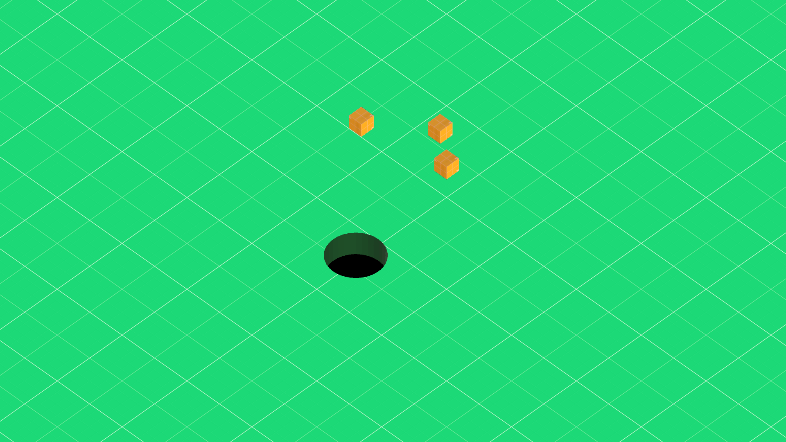

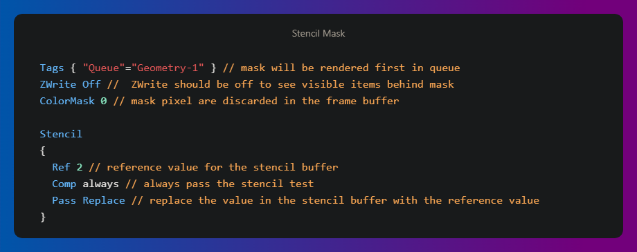

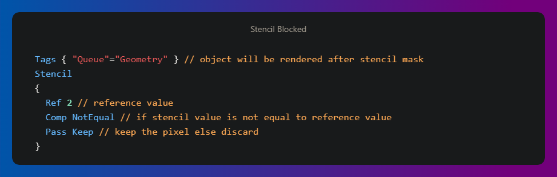

[See Full Stencil Shader Codes](Assets/Experiments/Experiment2_Stencil/Code/Shaders)

### Experiment_003 Kaleidoscope Effect

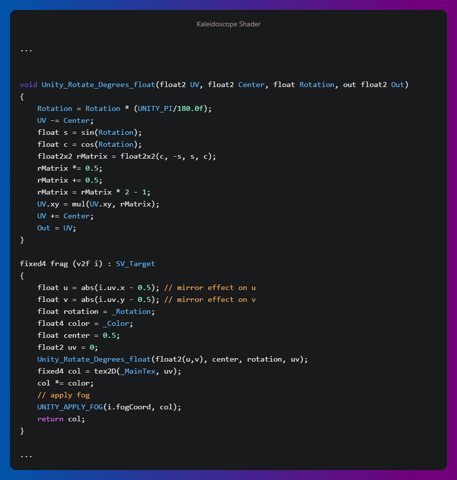

[See Full Kaleidoscope Effect Shader Codes](Assets/Experiments/Experiment3_Kaleidoscope/Code/Shaders/Kaleidoscope.shader)

**Note**: Unity_Rotate_Degrees_float is a function written by Unity included in Shader Graph. The function rotates the value of input UV around a reference point defined by the input Center by the amount of input rotation. [See in Shader Graph Manual](https://docs.unity3d.com/Packages/com.unity.shadergraph@7.1/manual/Rotate-Node.html)

### Experiment_004 Zoom Effect

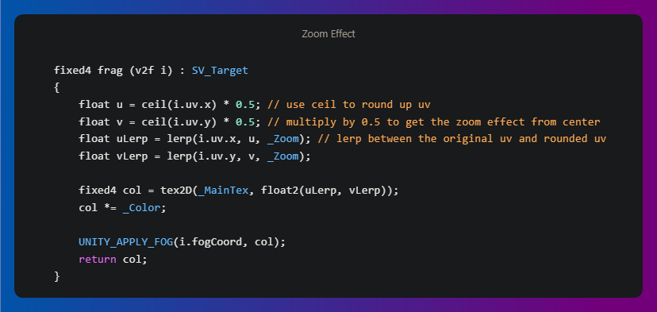
\
[See Full Zoom Effect Shader Codes](Assets/Experiments/Experiment4_Zoom/Code/Shaders/ZoomShader.shader)

### Experiment_005 Health Bar
#### Experiment_005.1 Simple Health Bar
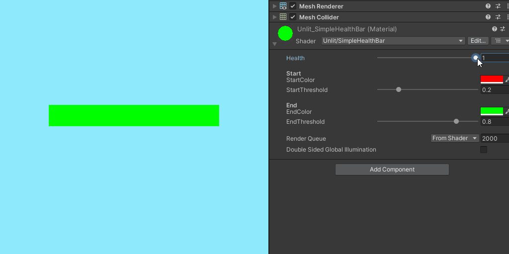
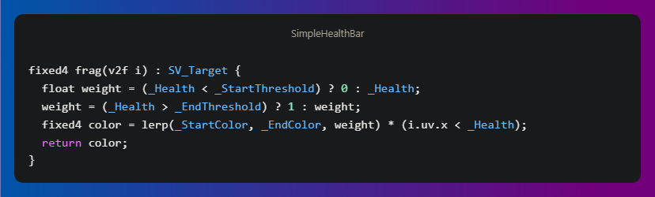

#### Experiment_005.2 Fancy Health Bar
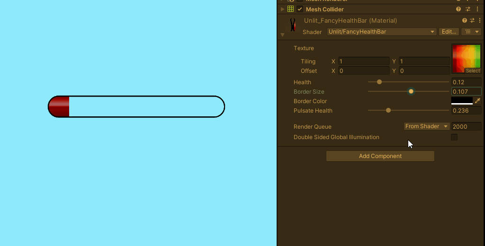
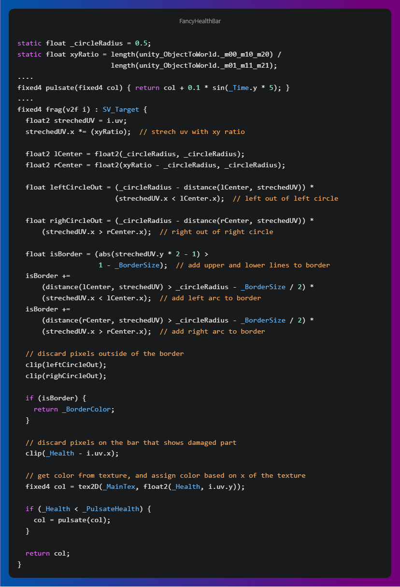

[See Full Healthbar Shader Codes](Assets/Experiments/Experiment5_HealthBar/Code/Shaders)
\
\
**Note**: My implementation for roundness and border is overcomplex. It can be easily made with SDF. Please watch [this part from Freya Holmér's Shader Video](https://youtu.be/mL8U8tIiRRg?t=4737) if you'd like to see a clean implementation.

### Experiment_006 Sprite Outline Effect

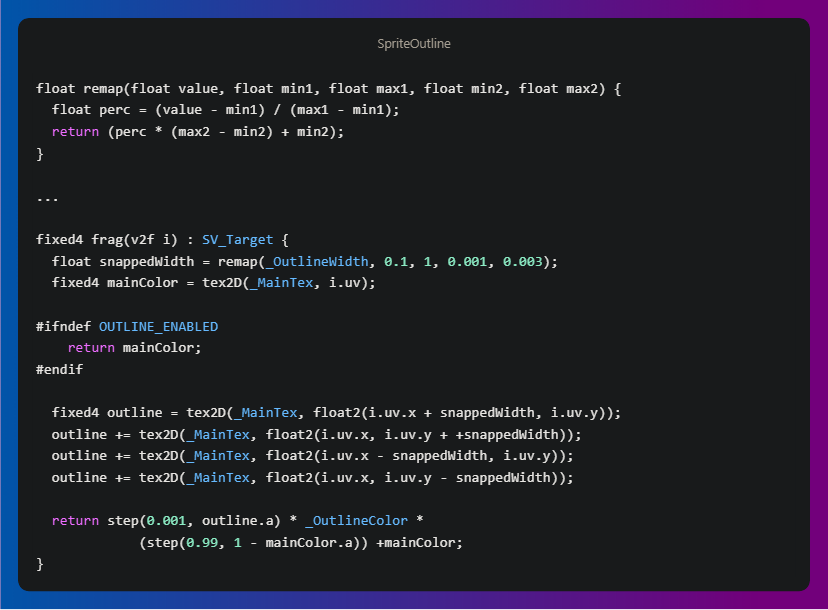
\
[See Full Sprite Outline Shader Codes](Assets/Experiments/Experiment6_SpriteOutline/Code/Shaders/SpriteOutlineShader.shader)

### Experiment_007 Lighting 

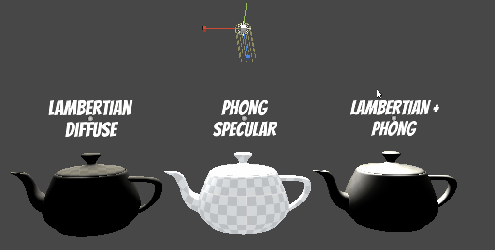
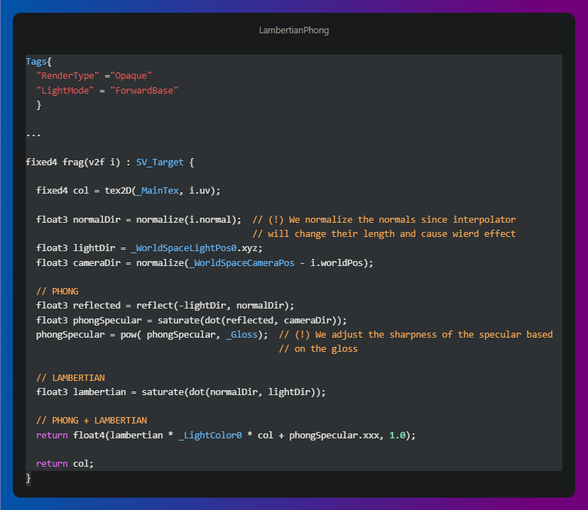
\
[See Full Lighting codes](Assets/Experiments/Experiment7_Lighting/Code/Shaders)
\
\
**Note 1**: _LightColor0, _WorldSpaceLightPos0 and _WorldSpaceCameraPos are built-in shader variables in Unity. See document [here](https://docs.unity3d.com/Manual/SL-UnityShaderVariables.html).
\
**Note 2**: reflect is a cg function that returns the reflection vector given an incidence vector i and a normal vector n. See document [here](https://developer.download.nvidia.com/cg/reflect.html).
\
**Note 3**: We used Tags{"LightMode" = "ForwardBase"} in code because we want to use Forward rendering. This rendering target is the default in Unity. See document [here](https://docs.unity3d.com/560/Documentation/Manual/SL-PassTags.html).

### Experiment_008 Fresnel Effect

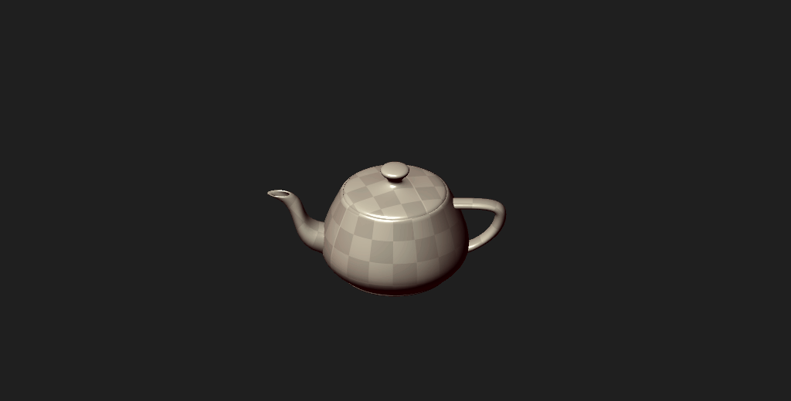

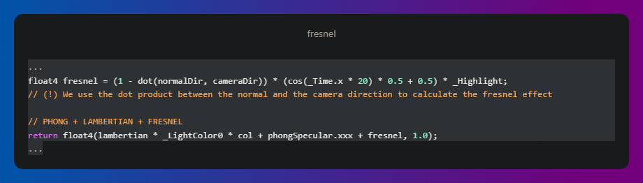

[See Full Fresnel Effect Shader Codes](Assets/Experiments/Experiment8_Fresnel/Code/Shaders/Fresnel.shader)

